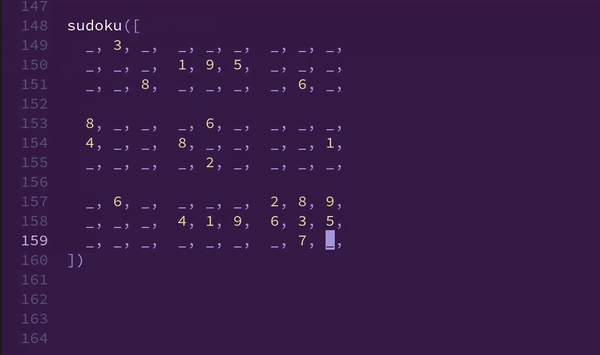
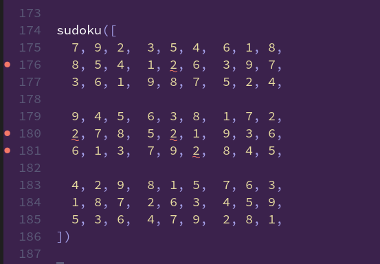
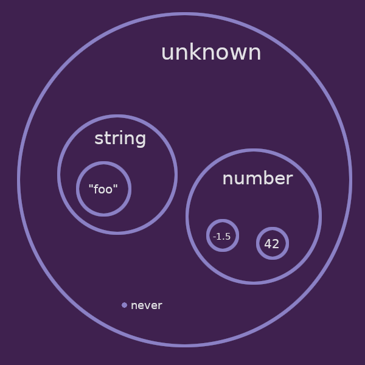
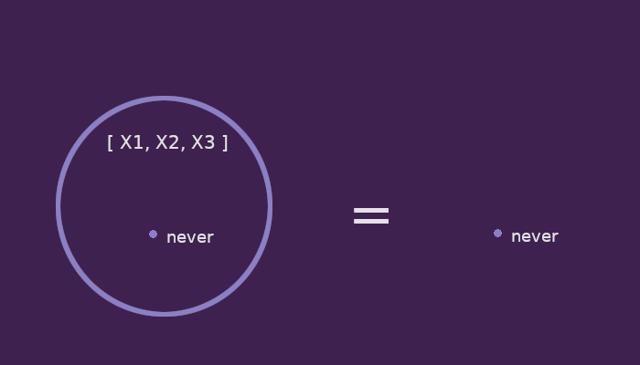
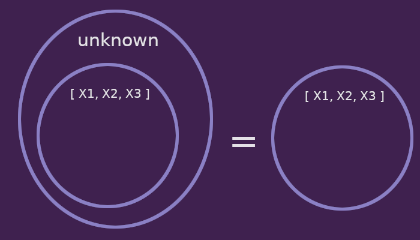

# TypeScript Sudoku

This is an experiment to precisely define a Sudoku type.
The goal is that we can play Sudoku in TypeScript while the type checker complains about mistakes.
We are not implementing a Sudoku solver.
This is purely an exercise in writing type definitions.
For the final result, check out [sudoku_v2.ts](./sudoku_v2.ts).



As a first approximation we can define the type as an array of numbers:

```typescript
type Sudoku = number[]
```

This permits all valid Sudokus, but also allows many *invalid* Sudokus.

```typescript
const invalidSudoku: Sudoku = [ -1, 7.5, 9, 9 ]
```
First, all array elements have to be integers in the range 1 to 9.
Second, Sudokus are 9-by-9 grids so we need an array with exactly 81 elements.
That's easy enough:

```typescript
type Cell = 1 | 2 | 3 | 4 | 5 | 6 | 7 | 8 | 9

type Sudoku = [
  Cell, Cell, Cell, Cell, Cell, Cell, Cell, Cell, Cell,
  Cell, Cell, Cell, Cell, Cell, Cell, Cell, Cell, Cell,
  Cell, Cell, Cell, Cell, Cell, Cell, Cell, Cell, Cell,
  Cell, Cell, Cell, Cell, Cell, Cell, Cell, Cell, Cell,
  Cell, Cell, Cell, Cell, Cell, Cell, Cell, Cell, Cell,
  Cell, Cell, Cell, Cell, Cell, Cell, Cell, Cell, Cell,
  Cell, Cell, Cell, Cell, Cell, Cell, Cell, Cell, Cell,
  Cell, Cell, Cell, Cell, Cell, Cell, Cell, Cell, Cell,
  Cell, Cell, Cell, Cell, Cell, Cell, Cell, Cell, Cell,
]
```
But the interesting part is: how do we enforce the Sudoku rules?
Currently, this still type checks:

```typescript
const invalidSudoku: Sudoku = [
  1, 1, 1, 1, 1, 1, 1, 1, 1,
  1, 1, 1, 1, 1, 1, 1, 1, 1,
  1, 1, 1, 1, 1, 1, 1, 1, 1,
  1, 1, 1, 1, 1, 1, 1, 1, 1,
  1, 1, 1, 1, 1, 1, 1, 1, 1,
  1, 1, 1, 1, 1, 1, 1, 1, 1,
  1, 1, 1, 1, 1, 1, 1, 1, 1,
  1, 1, 1, 1, 1, 1, 1, 1, 1,
  1, 1, 1, 1, 1, 1, 1, 1, 1,
]
```

We have to make sure that

 * all rows are duplicate free, 
 * all columns are duplicate free and
 * each of the 3-by-3 squares is also duplicate free.

For simplicity, let's just consider a 3-cell Sudoku for now:

```typescript
type BabySudoku = [ Cell, Cell, Cell ]
```
How can we require that the three cells all have different values?
The definition of a cell is dependent on other cells, 
so we need a way to reference individual cells.
By introducing a type parameter for every cell,
we can refer to cells by name:

```typescript
type BabySudoku<
  X1 extends Cell,
  X2 extends Cell,
  X3 extends Cell
> = [ X1, X2, X3 ]
```

Guess how many parameters the full 9-by-9 Sudoku needs.

A problem is, we have to instantiate these type parameters when we create `BabySudoku` values:

```typescript
const s: BabySudoku<1, 2, 3> = [ 1, 2, 3 ]
```

This is redundant.
The type parameters should get inferred from the value.
Type parameters on functions are automatically inferred:

```typescript
const func = <T>(val: T) => val

func<string>("hello") // type parameter can be provided ...
func("hello")         // ... but not necessary
```

So as a workaround we can put the type definition of `BabySudoku` into the argument of an arrow function:

```typescript
const babySudoku = <
  X1 extends Cell, 
  X2 extends Cell, 
  X3 extends Cell
>(cells: [ X1, X2, X3 ]) => cells
```

With that we can construct Sudokus, 
without instantiating type parameters explicitly:

```typescript
const s = babySudoku([1, 2, 3])
```

The runtime behavior of `babySudoku` is boring.
It just returns it's argument unchanged (aka. the identity function).
This is a bit awkward but so far I haven't found a better alternative.

## Constraints using `Exclude`

We still need to ensure that all cells are different, 
we can use the built-in utility type [`Exclude`](https://www.typescriptlang.org/docs/handbook/utility-types.html#excludeuniontype-excludedmembers).

```typescript
const babySudoku = <
  X1 extends Cell,
  X2 extends Cell, 
  X3 extends Cell
>(
  cells: [ 
    Exclude<X1, X2 | X3>, 
    Exclude<X2, X1 | X3>, 
    Exclude<X3, X1 | X2>, 
  ]
) => cells
```

This works! 
What's particularly nice about this approach is that the type checker highlights exactly the cells that are in conflict:



A downside is that the [full type definition](sudoku_v1.ts) is very large.
For each cell we have to explicitly list the other cells that are required to be different.
Writing that out manually is tedious.
I ended up [creating a script](generate_sudoku_v1.ts) just to print out the type definition.

I came up with another approach that has more compact type definitions. 
Before we can talk about that we need to talk about the types `unknown` and `never`.

## Interlude: `unknown` and `never`

`never` is the empty type, which makes it a sub-type of everything.
There is no value that has type `never`. 
So you always get a type error no matter what you write on the right-hand side of `const value: never = ???`.
That is, unless the assignment is unreachable or you use some malicous type cast: 
```typescript
const value: never = "obviously not never" as never
```
`never` is useful to strategically provoke a type error.
The plan is to formulate the Sudoku type in such a way, 
that it is equal to `never` IF constraints are violated.

`unknown` is a super-type of everything similar, to `any` ([What's the difference between `unknown` and `any`?](https://stackoverflow.com/a/51439876)). 



I find it useful to think of `unknown` and `never` as type-level analogs of `true` and `false`.
Because in combination with union types (`A | B`) and intersection types (`A & B`), 
`unknown` and `never` behave just like boolean OR (`a || b`) and boolean AND (`a && b`).
Notice the syntactic similarity of these operators.
For example, `unknown | never` is `unknown`, i.e. building the union of *absolutely-everything* and *absolutely-nothing* gives *absolutely-everything*.
Analogously, `true || false` is `true`.

Let's define type aliases, to make the relationship more obvious:
```typescript
type True = unknown
type False = never
```
With that we have:

| Term-level                    | Type-level                  | 
| ----------------------------- | --------------------------- |
| `true && true` is `true`      | `True & True` is `True`     |
| `true && false` is `false`    | `True & False` is `False`   |
| `true \|\| false` is `true`   | `True \| False` is `True`   |
| `false \|\| false` is `false` | `False \| False` is `False` |
| ...                           | ...                         |

Now that we can talk about booleans on the type-level, 
we can formulate arbitrary boolean constraints inside type definitions.

## Constraints using Type-Level Predicates

The plan is come of with some type-level boolean expression that describes the (Baby-)Sudoku constraints:
```typescript
type CheckSudokuConstraints<X1, X2, X3> = ??? // "returns" either `unknown` or `never`
```
At this point we can think of `CheckSudokuConstraints` as a function that returns `true` or `false` (aka. a predicate).
An analogous term-level function would look like this:
```typescript
function checkSudokuRules(x1: Cell, x2: Cell, x3: Cell): boolean {
   return ???
}
```

Once we know how to define `CheckSudokuConstraints` we build the intersection with the actual number grid:
```typescript
[ X1, X2, X3 ] & CheckSudokuConstraints<X1, X2, X3>
```
IF some Sudoku constraint is violated, then `CheckSudokuConstraints<X1, X2, X3>` "returns" `never` and we get:

```typescript
[ X1, X2, X3 ] & never             // ==> never
```

The intersection with the empty type is always the empty type, 
so the whole definition "collapses" down to `never`.



IF all Sudoku constraint are satisfied, 
then `CheckSudokuConstraints<X1, X2, X3>` "returns" `unknown` and we get:

```typescript
[ X1, X2, X3 ] & unknown          // ==> [ X1, X2, X3 ]
```

The intersection with `unknown` just leaves the number grid alone.



### Defining `CheckSudokuConstraints`

First we need a type-level predicate compare two cells.
We can use  
[conditional types](https://www.typescriptlang.org/docs/handbook/2/conditional-types.html) 
to check if two types are equal:
```typescript
type Equal<A, B> = A extends B ? (B extends A ? unknown : never) : never
// Equal<3, 3>    ==>    unknown
// Equal<3, 4>    ==>    never
```
If `A` is a subtype of `B` and `B` is a subtype of `A`, 
then `A` and `B` must be the same type.
Thus, we return true (`unknown`). 
Otherwise, we return false (`never`).

By negating the logic, 
we get a type-level predicate that tells us when two cells are different:

```typescript
type Different<A, B> = A extends B ? (B extends A  ? never : unknown) : unknown
// Different<3, 3>    ==>    never
// Different<3, 4>    ==>    unkown
```

To express that a bunch of cells are all different, we can go through all pairs.
Again, read the intersection type operator (`&`) just like boolean AND:
```typescript
  Different<X1, X2> & Different<X1, X3> 
& Different<X2, X1> & Different<X2, X3>
& Different<X3, X1> & Different<X3, X2>
```

Actually, `Different` is symmetric, i.e. 
`Different<X1, X2>` and `Different<X2, X1>` are the same,
so we can skip half the pairs:

```typescript
Different<X1, X2> & Different<X1, X3> & Different<X2, X3>
```

And that's already the definition of `CheckSudokuConstraints` for if we only have three cells:

```typescript
type CheckSudokuConstraints<X1, X2, X3> = Different<X1, X2> & Different<X1, X3> & Different<X2, X3>
```

For the full 81-cell Sudoku, the number of cells to compare is getting a bit out of hand.
We want to express that the cells in each row, each column and each square are pairwise different.
Rows, columns and squares always have exactly 9 cells.
So we can define one more utility type that just checks pairwise difference of 9 arbitrary cells:

```typescript
type AllDifferent<X1, X2, X3, X4, X5, X6, X7, X8, X9> = 
    Different<X1, X2> & Different<X1, X3> & Different<X1, X3>
  & Different<X1, X4> & Different<X1, X5> & Different<X1, X6>
  & Different<X1, X7> & Different<X1, X8> & Different<X1, X9>
  & ...
```

So finally, we can define `CheckSudokuConstraints` for the full Sudoku:

```typescript
type CheckSudokuConstraints<
  X11, X12, X13,  X14, X15, X16,  X17, X18, X19,
  X21, X22, X23,  X24, X25, X26,  X27, X28, X29,
  X31, X32, X33,  X34, X35, X36,  X37, X38, X39,

  X41, X42, X43,  X44, X45, X46,  X47, X48, X49,
  X51, X52, X53,  X54, X55, X56,  X57, X58, X59,
  X61, X62, X63,  X64, X65, X66,  X67, X68, X69,

  X71, X72, X73,  X74, X75, X76,  X77, X78, X79,
  X81, X82, X83,  X84, X85, X86,  X87, X88, X89,
  X91, X92, X93,  X94, X95, X96,  X97, X98, X99,
> = 
  // all 9 rows
  & AllDifferent<X11, X12, X13, X14, X15, X16, X17, X18, X19>
  & AllDifferent<X21, X22, X23, X24, X25, X26, X27, X28, X29>
  & AllDifferent<X31, X32, X33, X34, X35, X36, X37, X38, X39>
  & AllDifferent<X41, X42, X43, X44, X45, X46, X47, X48, X49>
  & AllDifferent<X51, X52, X53, X54, X55, X56, X57, X58, X59>
  & AllDifferent<X61, X62, X63, X64, X65, X66, X67, X68, X69>
  & AllDifferent<X71, X72, X73, X74, X75, X76, X77, X78, X79>
  & AllDifferent<X81, X82, X83, X84, X85, X86, X87, X88, X89>
  & AllDifferent<X91, X92, X93, X94, X95, X96, X97, X98, X99>

  // all 9 columns
  & AllDifferent<X11, X21, X31, X41, X51, X61, X71, X81, X91>
  & AllDifferent<X12, X22, X32, X42, X52, X62, X72, X82, X92>
  & AllDifferent<X13, X23, X33, X43, X53, X63, X73, X83, X93>
  & AllDifferent<X14, X24, X34, X44, X54, X64, X74, X84, X94>
  & AllDifferent<X15, X25, X35, X45, X55, X65, X75, X85, X95>
  & AllDifferent<X16, X26, X36, X46, X56, X66, X76, X86, X96>
  & AllDifferent<X17, X27, X37, X47, X57, X67, X77, X87, X97>
  & AllDifferent<X18, X28, X38, X48, X58, X68, X78, X88, X98>
  & AllDifferent<X19, X29, X39, X49, X59, X69, X79, X89, X99>

  // three upper squares
  & AllDifferent<X11, X12, X13, X21, X22, X23, X31, X32, X33>
  & AllDifferent<X14, X15, X16, X24, X25, X26, X34, X35, X36>
  & AllDifferent<X17, X18, X19, X27, X28, X29, X37, X38, X39>

  // three center squares
  & AllDifferent<X41, X42, X43, X51, X52, X53, X61, X62, X63>
  & AllDifferent<X44, X45, X46, X54, X55, X56, X64, X65, X66>
  & AllDifferent<X47, X48, X49, X57, X58, X59, X67, X68, X69>

  // three lower squares
  & AllDifferent<X71, X72, X73, X81, X82, X83, X91, X92, X93>
  & AllDifferent<X74, X75, X76, X84, X85, X86, X94, X95, X96>
  & AllDifferent<X77, X78, X79, X87, X88, X89, X97, X98, X99>
```

## Incomplete Sudokus

Until now we have only described complete Sudokus, 
where every cell is already filled with an integer.
To actually play Sudoku, we need to allow empty cells.

For that we pick some dummy value to represent an empty cell.
This can be anything, as long as it's not an number from 1 to 9:

```typescript
const _ = "empty cell"

type EmptyCell = typeof _
```

Now we *could* redefine `Cell` to include this value:

```typescript
type Cell = 1 | 2 | 3 | 4 | 5 | 6 | 7 | 8 | 9 | EmptyCell // bad idea
```
But then, the constraints also apply to empty cells 
and the type checker starts complaining about two empty cells in the same row etc.
Empty cells should be unconstrained and allowed everywhere.
We can do that by explicitly annotating each cell with `| EmptyCell`:

```typescript
[ X1 | EmptyCell, X2 | EmptyCell, X3 | EmptyCell ] & CheckSudokuConstraints<X1, X2, X3>
```
So in each cell we either allow an empty cell or we allow an integer from 1-9 that is additionally constrained.

## Conclusion

This is not really useful.
One could try to implement a statically verified Sudoku solver based on these type definitions: 

```typescript
function solveSudoku(grid: IncompleteSudoku): CompleteSudoku { /* ... */ }
```

This would give very high confidence in the implementations correctness.
However, it's probably hard to convince the type checker that the code really matches the spec.
Even then, error messages are not very friendly and, 
depending on the TypeScript version, 
it can take multiple seconds to type check the code.

On the other hand, I believe many people have the impression that types can only talk about very superficial structure of data.
I think it's interesting to see how much expressivity can be squeezed out of the type system.
